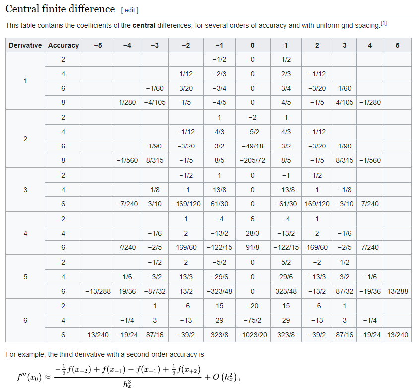
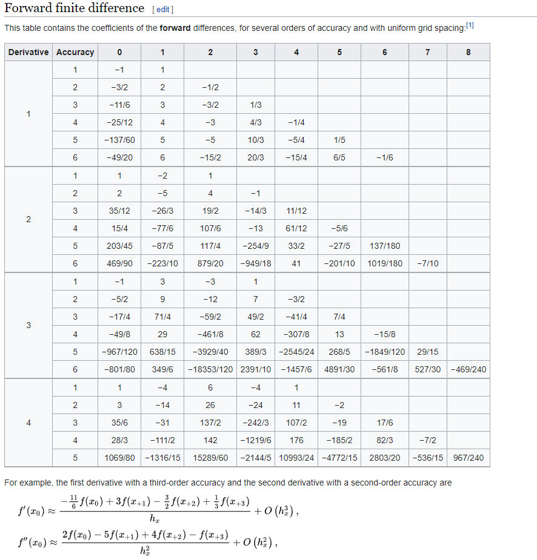

# FDM 1D 公式推导

推导 FDM 的公式, 用到的方法为待定系数法 (method of undetermined coefficients)。通过待定系数 + 泰勒展开, 就可以推导出 FDM 差分的格式。函数 $u(x)$ 在 $\bar{x}$ 点处泰勒展开的形式为:

$$
u(x_i) = u(\bar{x}) + (x_i-\bar{x})u'(\bar{x}) + ... + \frac{1}{k!} (x_i - \bar{x})^k u^{(k)} (\bar{x}) + ...
$$

其中 $x_i$ 的下标 $i$ 表明这是离散后第 $i$ 个点。当我们想要用 $n$ 个点表示 $u(x)$ 的 $k$ 阶导的时候, 根据待定系数法有表达式: 

$$
u^{(k)} (\bar{x}) + O(h^p) = c_1 u(x_1) + c_2 u(x_2) + c_3 u(x_3) + ... + c_n u(x_n)
$$

其中 $p$ 表示 $p$ 阶精度。我们对等式右边每一项 $u(x_n)$ 做泰勒展开, 并且希望通过等式右边所有项的组合, 只剩下关于 $u^{(k)} (\bar{x})$ 的项, 并由此推导出所有的系数。由此可以看出, 如果我们需要求 $k$ 阶导, 就需要上式右边展开后保证 $u(\bar{x})$ 的 $0$ 阶, $1$ 阶, $2$ 阶, ..., $k-1$阶, $k+1$阶 ... 等等这些阶导数前的系数为0, $k$ 阶导前面的系数为 $1$。同时我们看出, 如果想求 $k$ 阶导的表达式, 待定系数法展开后等式右边至少要出现 $0$ 阶导一直到$k$阶导, 这对应于 $k+1$ 个系数, 即 $k+1$ 个点。所以说: 推导 $k$ 阶导, 需要至少用到 $k+1$ 个节点, 即 $n \geq k+1$。


上述文字可以总结为, 对于任意一个 $m$ 阶导$u^{(m)} (\bar{x})$, 其中 $ 0 \leq m \leq n-1$ ($n$ 个点对应最多 $n-1$ 阶导), 其前面的系数要满足: 

$$
\frac{1}{m!} \sum_{j=1}^{n} c_j (x_j - \bar{x})^m = \begin{cases}
1  \quad \text{if} \quad m=k \\
0  \quad \text{otherwise}
\end{cases}
$$

将上式改写为矩阵 $Ac=b$ 的形式, 令 $m=i-1$, $1 \leq i \leq n$: 
$$
\frac{1}{(i-1)!} \sum_{j=1}^{n} (x_j - \bar{x})^{i-1} c_j = \begin{cases}
1  \quad \text{if} \quad i-1=k \\
0  \quad \text{otherwise}
\end{cases}
$$

所以矩阵 $A$ 为: 

$$
a_{ij} = \frac{1}{(i-1)!} \sum_{j=1}^{n} (x_j - \bar{x})^{i-1}
$$


不失一般性, 我们令所有的网格间距都是 $h=1$, 这样推导出来的 $u^{(k)} (\bar{x}) = c_1 u(x_1) + c_2 u(x_2) + c_3 u(x_3) + ... + c_n u(x_n)$。当推广到 $h\neq 1$ 的情况时, 只需要等式右边都除以 $h^k$ 即可 (对于联立的每一个等式, 对于那些Ax=b, 等式右边为0的行, h 是否为1都总是满足的, 只影响 i=k+1 那一行)。


可以有程序: 
```python
import numpy as np

# decimal to fractions
# https://stackoverflow.com/questions/42209365/numpy-convert-decimals-to-fractions
import fractions
np.set_printoptions(formatter={'all':lambda x: str(fractions.Fraction(x).limit_denominator())})


def fd_coeff(k, x_i, x):
    """
    use n points to evaluate kth derivative of u(x_{0})
    :param k: (int) kth derivative of u(x)
    :param x_i: (np.arrray, shape=(n,)) array of [..., x_{-1}, x_{0}, x_{1}, ...]
        n should greater than or equal to  k+1
    :param x: (float) target point
    """
    n = x_i.shape[0]
    A = np.zeros((n,n))
    for i in range(n):
        for j in range(n):
            ii = i+1
            A[i, j] = 1/np.math.factorial(ii-1) * (x_i[j] - x)**(ii-1)
    b = np.zeros(n)
    b[k+1-1] = 1
    return np.linalg.solve(A, b)
```

程序应用举例:
```python
if __name__ == '__main__':
    x_i = np.array([-3., -2, -1, 0, 1, 2, 3])
    x = 0
    sol = fd_coeff(4, x_i, x)
    print(sol)
```
会打印:
```python
[-1/6 2 -13/2 28/3 -13/2 2 -1/6]
```

该程序可以求出表中的所有系数 (https://en.wikipedia.org/wiki/Finite_difference_coefficient):




