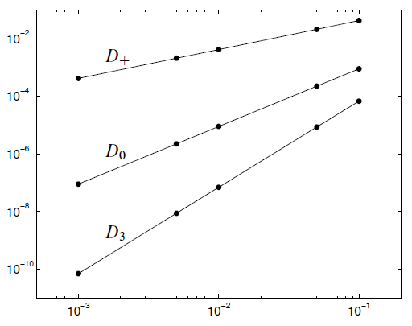

# FDM 基本概念

* 精度 

一种格式具有 $p$ 阶精度, 取决于该格式的误差 $E\propto h^p$, 其中 $h$ 是网格步长。

* 为什么误差随着$h$ 变化的图适合用 log-log scale 表述:

$$
E(h) \approx C h^p \\
\mathrm{lg} |E(h)| \approx \mathrm{lg} C + p\mathrm{lg} h
$$

于是, 误差和步长的关系在图中就是线性的。比如长这个样子 [^1]: 

# 有限差分格式 [^2]

$$
\begin{aligned}
&u^{\prime}\left(t_{n}\right) \approx\left[D_{t} u\right]^{n}=\frac{u^{n+\frac{1}{2}}-u^{n-\frac{1}{2}}}{\Delta t}\\
&u^{\prime}\left(t_{n}\right) \approx\left[D_{2 t} u\right]^{n}=\frac{u^{n+1}-u^{n-1}}{2 \Delta t}\\
&u^{\prime}\left(t_{n}\right)=\left[D_{t}^{-} u\right]^{n}=\frac{u^{n}-u^{n-1}}{\Delta t}\\
&u^{\prime}\left(t_{n}\right) \approx\left[D_{t}^{+} u\right]^{n}=\frac{u^{n+1}-u^{n}}{\Delta t}\\
&u^{\prime}\left(t_{n+\theta}\right)=\left[\bar{D}_{t} u\right]^{n+\theta}=\frac{u^{n+1}-u^{n}}{\Delta t}\\
&u^{\prime}\left(t_{n}\right) \approx\left[D_{t}^{2-} u\right]^{n}=\frac{3 u^{n}-4 u^{n-1}+u^{n-2}}{2 \Delta t}\\
&u^{\prime \prime}\left(t_{n}\right) \approx\left[D_{t} D_{t} u\right]^{n}=\frac{u^{n+1}-2 u^{n}+u^{n-1}}{\Delta t^{2}}\\
&u\left(t_{n+\frac{1}{2}}\right) \approx\left[\bar{u}^{t}\right]^{n+\frac{1}{2}}=\frac{1}{2}\left(u^{n+1}+u^{n}\right)\\
&u\left(t_{n+\frac{1}{2}}\right)^{2} \approx\left[{\overline{u^{2}}}^{t, g}\right]^{n+\frac{1}{2}}=u^{n+1} u^{n}\\
&u\left(t_{n+\frac{1}{2}}\right) \approx\left[\bar{u}^{t, h}\right]^{n+\frac{1}{2}}=\frac{2}{\frac{1}{u^{n+1}}+\frac{1}{u^{n}}}\\
&u\left(t_{n+\theta}\right) \approx\left[\bar{u}^{t, \theta}\right]^{n+\theta}=\theta u^{n+1}+(1-\theta) u^{n}\\
&t_{n+\theta}=\theta t_{n+1}+(1-\theta) t_{n-1}
\end{aligned}
$$

# 离散记号

时域: 
$$
n=0,1,...,N_t \\
t=n\Delta t \\
t_{max} = T = N_t \Delta t
$$
总之, 有$N_t$ 个 space, $N_t + 1$ 个 node. 

空间:
$$
i = 0, 1, ..., N_x \\
x_i = i \Delta x \\
$$
总之, 有 $N_x$ 个 space, $N_x + 1$ 个 node. 

# 参考文献
[^1]: Finite Difference Methods for Ordinary and Partial Differential Equations, Randall J. LeVeque, 2007
[^2]: Finite Difference Computing with PDEs - A Modern Software Approach, Langtangen