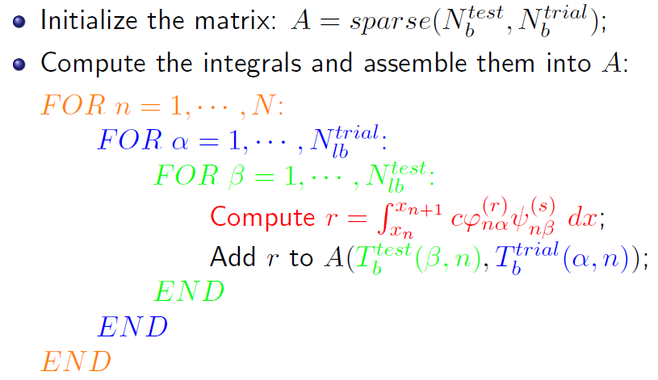
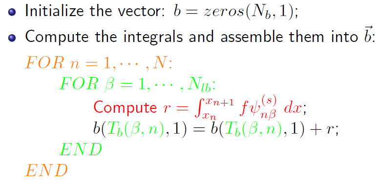
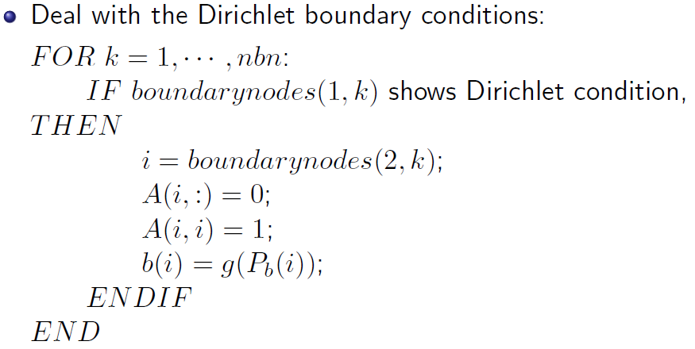

# Chapter 1. Finite elements for 1D second order elliptic equation

目标方程（一维，稳态，线性，二阶，椭圆）：

$$
-\frac{d}{dx} \left( c(x) \frac{du(x)}{dx} \right)=f(x),  \quad a<x<b
$$

构建弱格式：

1. 原方程两边同时乘以 test function $v(x)$ 并积分:

$$
-\frac{d}{dx} \left( c(x) \frac{du(x)}{dx} \right)=f(x),  \quad a<x<b \\
-\frac{d}{dx} \left( c(x) \frac{du(x)}{dx} \right) v(x)=f(x) v(x),  \quad a<x<b \\
-\int_a^b \frac{d}{dx} \left( c(x) \frac{du(x)}{dx} \right) v(x) dx= \int_a^b f(x) v(x) dx,  \quad a<x<b
$$

$u(x)$ 是 trial function. trial function 完全由物理物理决定，人能做的只是去逼近它。test function $v(x)$ 完全由人决定，可以自由地选取 test function 的形式。

2. 分部积分:

$$
\begin{aligned}
LHS &= - \int_a^b \frac{d}{dx} \left( c(x) \frac{du(x)}{dx} \right) v(x) dx \\
&=- \int_a^b (cu')' v  dx \\
&=- \int_a^b (cu'v)' - cu'v'  dx \\
&=- cu'v|^b_a + \int_a^b  cu'v'  dx \\
\end{aligned}
$$

于是得到:

$$
-c(b) u'(b) v(b) + c(a) u'(a) v(a) + \int_a^b  cu'v'  dx = \int_a^b fv dx
$$

方程两边自然而然出现了 trial function 的导数，所以Neumann 和 Robin 边界条件称为自然边界条件，直接代入即可。 Dirichlet 边界条件没有自然而然地出现在弱格式方程中，所以称为强制边界条件。

## Dirichlet 边界条件

对于强制边界条件来说，$u(a)=g_a, \quad u_b=g_b$, trial function 在 $a,b $ 两点的值已经知道了，没必要 test 了，为了简化问题，通常取 $v(a)=v(b)=0$ 。

所以待求解的弱格式化为:

$$
\int_a^b  cu'v'  dx = \int_a^b fv dx
$$

并且 trial function 和 test function 都属于 Sobolev space. 从写程序的角度，不用太深入理解 Sobolev 空间，因为在有限元空间中基函数全部是多项式，多项式函数的弱导数 （$u'$ 可以在个别点不存在， 但依然保证弱格式方程成立）就等于强导数。由此还有一些其他概念，比如 $L^2$ 空间 （函数平方可积的空间）， $H^1$ 空间 （函数不仅仅平方可积，而且存在一阶弱导数）, $H^1_0$ 空间（函数平方可积+存在一阶弱导数+边界上值为0）. 对于强制边界条件来说, $v(x)\in H^1_0$

为什么弱格式称为弱格式？因为原来待求解的偏微分方程要求 $u$ 具有二阶强导数，现在只需要一阶弱导数，对 $u(x)$ 的要求弱化了。

如果令 $a(u,v)= \int_a^b  cu'v'  dx$, 并且 $(f,v)=\int_a^b fv dx$ , 弱格式也可以写为有限元的通用分析结构：

$$
a(u,v)=(f,v)
$$

什么是 Galerkin 法？ 用有限维空间代替无穷维空间。将无穷维划分到有限维有很多方法，就是各种 xxx-Galerkin method.

使用 Galerkin 格式离散弱格式：

对于 $u_h \in U_h$, $v_h\in U_{h0}$, 弱格式有:

$$
a(u_h,v_h)=(f,v_h)
$$

其中:

$$
u_h = \sum_{j=1}^{N+1} u_j \phi_j
$$

$N$ 是网格单元数。 $N+1$ 是节点数，也是基函数的个数，也是有限元空间的维数。

有限元算法的任务，就是寻找 $u_j$ 。原方程有 $N+1$ 个未知量 $u_j$, 所以需要 $N+1$ 个方程，这对应这选取 $N+1$ 个 test function. 最简单的做法，是选择 $v_h=\phi_i$.

此时离散后的弱格式变为：

$$
\begin{aligned}
\int_a^b  cu'v'  dx &= \int_a^b fv dx \\
\int_a^b  c \left(\sum_{j=1}^{N+1} u_j \phi_j \right)'\phi_i'  dx &= \int_a^b f \phi_i dx, \quad i=1, 2, ..., N+1 \\
\sum_{j=1}^{N+1} u_j  \left[ \int_a^b  c   \phi_j '\phi_i'  dx \right] &= \int_a^b f \phi_i dx, \quad i=1, 2, ..., N+1
\end{aligned}
$$

由此，定义 stiffness matrix $A$ ($A$ 显然是对称的) :

$$
A = [a_{ij}]_{i,j=1}^{N+1} , \quad a_{ij}=   \int_a^b  c   \phi_j '\phi_i'  dx
$$

定义 load vector $\vec{b}$:

$$
\vec{b}=[b]_{i=1}^{N+1} , \quad b_i =  \int_a^b f \phi_i dx
$$

定义 unknown vector $\vec{x}$:

$$
\vec{x} = [u_j]_{j=1}^{N+1}
$$

则离散后的弱格式可以表示为:

$$
A \vec{x} = \vec{b}
$$

接下来，非常重要的一步，“单刚组装总刚”。所谓的单刚组装总刚，指的是一种求解 $a_{ij}$ 的方法:

$$
a_{ij}=   \int_a^b  c   \phi_j '\phi_i'  dx = \sum_{n=1}^{N} \int_{x_n}^{x_{n+1}} c   \phi_j '\phi_i'  dx \quad  i,j=1, 2, ..., N+1
$$

$a_{ij}$ 的求解本来是全局积分，现在是局部单元积分的求和 ，显然大部分的局部积分是0.

对于 Dirichlet BC 来说，$[\vec{x}]_1=u_1=g_a$ 以及 $[\vec{x}]_{N+1}=u_{N+1}=g_b$ 已经知道了，所以可以扔掉第$1$ 和 $N+1$ 个test function，有:

$$
\begin{aligned}
& A(1, :) = 0 \\
& A(1,1) = 1 \\
& A(N+1, :) = 0 \\
& A(N+1,N+1) = 1 \\
& b(1)=g_a \\
& b(N+1) = g_b
\end{aligned}
$$

## Neumann边界条件

出发公式：

$$
-c(b) u'(b) v(b) + c(a) u'(a) v(a) + \int_a^b  cu'v'  dx = \int_a^b fv dx
$$

边界条件都为Neumann是不行的，这样会造成无穷多解。这里我们考虑 $u(a)$ 已知，$u'(b)=r_b$，则:

$$
\begin{aligned}
-c(b) r_b v(b) + \int_a^b  cu'v'  dx &= \int_a^b fv dx \\
\int_a^b  cu'v'  dx &= \int_a^b fv dx + c(b) r_b v(b) \\
\sum_{j=1}^{N+1} u_j  \left[ \int_a^b  c   \phi_j '\phi_i'  dx \right] &= \int_a^b f \phi_i dx + r_bc(b)\phi_i(b), \quad i=1, 2, ..., N+1
\end{aligned}
$$

此时 load vector $\vec{b}$ 变为:

$$
\vec{b}=[b]_{i=1}^{N+1} , \quad b_i =  \int_a^b f \phi_i dx + r_bc(b)\phi_i(b)
$$

易知，$\phi_i(b)$ 只有在边界对应的点处才有值 （$\delta_{ij}$ 的性质）。增加 Neumann 边界条件的后果是改变 load vector.

同理，如果已知的边界条件为：考虑 $u'(a)=r_a$ ，$u(b)=g(b)$ , 则：

$$
-c(b) u'(b) v(b) + c(a) u'(a) v(a) + \int_a^b  cu'v'  dx = \int_a^b fv dx  \\
 c(a) r_a v(a) + \int_a^b  cu'v'  dx = \int_a^b fv dx
$$

最后 load vector $\vec{b}$ 变为:

$$
\vec{b}=[b]_{i=1}^{N+1} , \quad b_i =  \int_a^b f \phi_i dx - r_a c(a)\phi_i(a)
$$

## Robin边界条件

出发公式：

$$
-c(b) u'(b) v(b) + c(a) u'(a) v(a) + \int_a^b  cu'v'  dx = \int_a^b fv dx
$$

这里我们考虑 $u(a)=g(a)$ 已知，$u'(b)+q_b u(b)=p_b$，则:

$$
\begin{aligned}
-c(b) [p_b - q_b u(b)] v(b) + \int_a^b  cu'v'  dx &= \int_a^b fv dx \\
-c(b) p_b v(b) + c(b) q_b u(b) v(b) + \int_a^b  cu'v'  dx &= \int_a^b fv dx \\
  q_b c(b) u(b) v(b) + \int_a^b  cu'v'  dx &= \int_a^b fv dx + p_b c(b) v(b) \\
\sum_{j=1}^{N+1} u_j [q_b c(b) \phi_j(b) \phi_i(b)] +  \sum_{j=1}^{N+1} u_j  \left[ \int_a^b  c   \phi_j '\phi_i'  dx \right] &= \int_a^b f \phi_i dx + p_b c(b)\phi_i(b), \quad i=1, 2, ..., N+1
\end{aligned}
$$

此时 stiff matrix $A$ 变为：

$$
A = [a_{ij}]_{i,j=1}^{N+1} , \quad a_{ij}=   \int_a^b  c   \phi_j '\phi_i'  dx + q_b c(b) \phi_j(b) \phi_i(b)
$$

易知，$\phi_j(b)$ 和 $\phi_i(b)$ 只有在边界对应的点处才有值，且$i=j$ （$\delta_{ij}$ 的性质）。增加 Robin 边界条件的后果之一是改变 stiff matrix $A$ 对角线上的一个值.

此时 load vector $\vec{b}$ 变为:

$$
\vec{b}=[b]_{i=1}^{N+1} , \quad b_i =  \int_a^b f \phi_i dx + p_b c(b)\phi_i(b)
$$

易知， $\phi_i(b)$ 只有在边界对应的点处才有值（$\delta_{ij}$ 的性质）。增加 Robin 边界条件的后果之一是改变 load vector $\vec{b}$ 中的一个值。

同理，我们考虑 $u(b)=g(b)$ 已知，$u'(a)+q_a u(a)=p_a$，则:

$$
c(a) [p_a - q_a u(a)] v(a) + \int_a^b  cu'v'  dx = \int_a^b fv dx \\
-\sum_{j=1}^{N+1} u_j [q_a c(a) \phi_j(a) \phi_i(a)] +  \sum_{j=1}^{N+1} u_j  \left[ \int_a^b  c   \phi_j '\phi_i'  dx \right] = \int_a^b f \phi_i dx - p_a c(a)\phi_i(a), \quad i=1, 2, ..., N+1
$$

此时 stiff matrix $A$ 变为：

$$
A = [a_{ij}]_{i,j=1}^{N+1} , \quad a_{ij}=   \int_a^b  c   \phi_j '\phi_i'  dx - q_a c(a) \phi_j(a) \phi_i(a)
$$

此时 load vector $\vec{b}$ 变为:

$$
\vec{b}=[b]_{i=1}^{N+1} , \quad b_i =  \int_a^b f \phi_i dx - p_a c(a)\phi_i(a)
$$

## 通用有限元程序结构

几个定义:

* $N$ : 单元个数
* $N_m$ : 节点个数。一维中$N_m=N+1$
* $N_{lb}$ : 局部基函数个数
* $N_b$ : 有限元基函数个数，也是有限元的节点个数。
* $P$ : 网格单元节点坐标阵。$P$ 矩阵第 $k$ 列存储的是第 $k$ 个节点的坐标
* $T$ : 网格单元节点编号阵。 $T$ 矩阵的第 $k$ 列存储的是第 $k$ 个单元的节点编号。(局部编号是每一列的存储规则，全局编号是 $T$ 矩阵的存储规则)
* $P_b$ : 有限元单元节点坐标阵。下标 $b$ 是 basis 的意思。用途：查找积分上下限
* $T_b$ : 有限元单元节点编号阵。用途：查找单元内局部基函数对应的全局编号，进而求解积分->组装矩阵。一定要注意 $T_b$ 矩阵的第 n 列对应的全局节点编号的顺序，与局域基函数的顺序是相同的！！！（参考ppt p107）
* $\psi_{n \alpha}, \psi_{n \beta}$ : 代表第 $n$ 个单元上第 $\alpha$ 个基函数（对应trial function） 和第 $\beta$ 个基函数(对应 test function)。$a_{ij}$ 中 $i=T_b(\beta, n), j=T_b(\alpha, n)$
* $\psi_{n \alpha}^{(r)}, \psi_{n \beta}^{(s)}$ : 代表着第 $n$ 个单元上第 $\alpha$ 个基函数（对应trial function）的$r$ 阶导 和第 $\beta$ 个基函数(对应 test function) 的$s$ 阶导。一维情况下 $r=s=1$
* $\varphi_{n \alpha}^{(r)}, \psi_{n \beta}^{(s)}$ : trial 和 test 基函数相同的情况是 Bubnov-Galerkin method, trial 和test 不同是 Petrov-Galerkin method. 在 Petrov-Galerkin method 中，trial function记作 $\varphi_{n \alpha}^{(r)}$
* $boundarynodes(1,k)$ : 边界点矩阵，1 是类型， $k$ 是边界点的全局编号。
* $nbn$ : number of boundary nodes

最通用的单刚组装总刚 (所有涉及到节点的地方区分trial 和 test):

组装 $\vec{b}$ :

Dirichlet BC:

# 其它

ppt 中，绿色代表 test, 蓝色代表 trial ，黄色代表单元。
