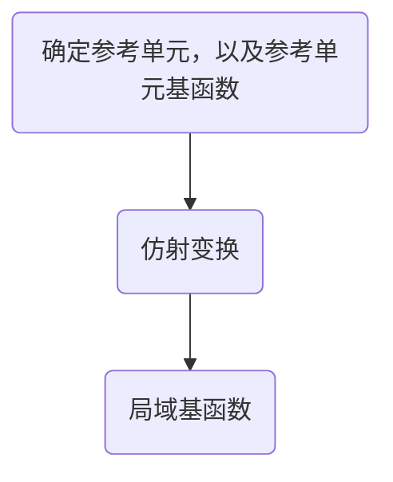
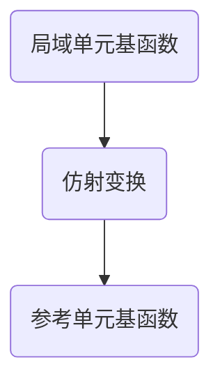

# FEM-仿射变换
推导时, 仿射变换流程:



使用时, 仿射变换流程:



## 参考单元以及参考单元基函数

### triangle elements

确定参考单元，$\hat{E}=\bigtriangleup \hat{A_1}\hat{A_2}\hat{A_3}$, 其中三个参考节点的坐标为: $\hat{A_1}=(0,0)$, $\hat{A_2}=(1,0)$, $\hat{A_3}=(0,1)$.

### linear basis functions

线性情况下，三个节点对应三个基函数，每个基函数有三个未知数: 
$$
\hat{\psi_j}(\hat{A_i}) = \delta_{ij} = 
\begin{cases}
0, \quad \text{if} \quad j \neq i & \\
1, \quad \text{if} \quad j =i & 
\end{cases}
$$
for $i,j=1,2,3$

$\hat{\psi_j} (x,y)$具有形式:
$$
\hat{\psi_j} = a_j \hat{x} + b_j \hat{y} + c_j , \quad j=1,2,3
$$

所以求解每一个$\hat{\psi_j} (x,y)$对应着三个方程: 
$$
\hat{\psi_1} (\hat{A_1}) = 1, \quad \hat{\psi_1} (\hat{A_2}) = 0, \quad  \hat{\psi_1} (\hat{A_3}) = 0 \\
\hat{\psi_2} (\hat{A_1}) = 0, \quad \hat{\psi_2} (\hat{A_2}) = 1, \quad  \hat{\psi_2} (\hat{A_3}) = 0 \\
\hat{\psi_3} (\hat{A_1}) = 0, \quad \hat{\psi_3} (\hat{A_2}) = 0, \quad  \hat{\psi_3} (\hat{A_3}) = 1
$$

求解时, 以 $\hat{\psi_1}$ 为例: 
$$
\begin{pmatrix}
x_1 & y_1 & 1 \\
x_2 & y_2 & 1 \\
x_3 & y_3 & 1
\end{pmatrix}
\begin{pmatrix}
a_j  \\
b_j  \\
c_j 
\end{pmatrix}=
\begin{pmatrix}
1  \\
0  \\
0 
\end{pmatrix}
$$
通过以下代码，求得 $x=(-1,-1,1)$, 所以 $a_1=-1, b_1=-1, c_1=1$
```python
import numpy as np
A = np.array([
    [0,0,1],  # x1, y1, 1
    [1,0,1],  # x2, y2, 1
    [0,1,1]   # x3, y3, 1
    ])
b = np.array([0,0,1])
x = np.linalg.solve(A,b)
print(x)
```
同理，求得 $a_2=1, b_2=0, c_2=0$， $a_3=0, b_3=1, c_3=0$.
所以参考单元基函数为: 
$$
\begin{aligned}
\hat{\psi_1} &=-\hat{x}-\hat{y}+1 \\
\hat{\psi_2} &= \hat{x} \\
\hat{\psi_3} &= \hat{y} 
\end{aligned}
$$

#### affine mapping

* 坐标的仿射变换

在局域网格中，我们总是把局域单元 $ E=\bigtriangleup  A_1 A_2 A_3$ 映射到参考单元 $\hat{E}=\bigtriangleup \hat{A_1}\hat{A_2}\hat{A_3}$。 $A_1 A_2 A_3$ 三个点的顺序是自己任意指定的，但是会影响 $T$ 和 $T_b$ 矩阵每一列中的行序。
有仿射变换: 
$$
\begin{aligned}
&\hat{A}_{1}=\left(\begin{array}{l}
0 \\
0
\end{array}\right) \quad \rightarrow\left(\begin{array}{l}
x_{1} \\
y_{1}
\end{array}\right)=A_{1} \\
&\hat{A}_{2}=\left(\begin{array}{l}
1 \\
0
\end{array}\right) \quad \rightarrow\left(\begin{array}{l}
x_{2} \\
y_{2}
\end{array}\right)=A_{2} \\
&\hat{A}_{3}=\left(\begin{array}{l}
0 \\
1
\end{array}\right) \quad \rightarrow \left(\begin{array}{l}
x_{3} \\
y_{3}
\end{array}\right)=A_{3}
\end{aligned}
$$

所以: 
$$
\begin{aligned}
\left(\begin{array}{l}
x \\
y
\end{array}\right) &=\left(A_{2}-A_{1}, A_{3}-A_{1}\right)\left(\begin{array}{l}
\hat{x} \\
\hat{y}
\end{array}\right)+A_{1} \\
&=\left(\begin{array}{ll}
x_{2}-x_{1} & x_{3}-x_{1} \\
y_{2}-y_{1} & y_{3}-y_{1}
\end{array}\right)\left(\begin{array}{l}
\hat{x} \\
\hat{y}
\end{array}\right)+\left(\begin{array}{l}
x_{1} \\
y_{1}
\end{array}\right)
\end{aligned}
$$

所以: 

$$
\left(\begin{array}{l}
\hat{x} \\
\hat{y}
\end{array}\right) = 
\left(\begin{array}{ll}
x_{2}-x_{1} & x_{3}-x_{1} \\
y_{2}-y_{1} & y_{3}-y_{1}
\end{array}\right)^{-1}
\left(\begin{array}{l}
x-x_1 \\
y-y_1
\end{array}\right)
$$

2x2 矩阵的逆矩阵: 
$$
A^{-1} = 
\left(
\begin{array}{l}
a & b \\
c & d \\
\end{array} \right)^{-1} = 
\frac{1}{|A|}
\left(
\begin{array}{l}
d  & -b \\
-c & a  \\
\end{array} \right)
$$

所以: 
$$
\begin{aligned}
&\hat{x}=\frac{\left(y_{3}-y_{1}\right)\left(x-x_{1}\right)-\left(x_{3}-x_{1}\right)\left(y-y_{1}\right)}{|J|} \\
&\hat{y}=\frac{-\left(y_{2}-y_{1}\right)\left(x-x_{1}\right)+\left(x_{2}-x_{1}\right)\left(y-y_{1}\right)}{|J|}
\end{aligned} 
$$

$$
J=\left(\begin{array}{ll}
x_{2}-x_{1} & x_{3}-x_{1} \\
y_{2}-y_{1} & y_{3}-y_{1}
\end{array}\right) \\
|J|=\left(x_{2}-x_{1}\right)\left(y_{3}-y_{1}\right)-\left(x_{3}-x_{1}\right)\left(y_{2}-y_{1}\right),
$$

* 基函数的仿射变换

局域单元上的基函数和参考单元上的基函数具有关系: 
$$
\psi(x,y) = \hat{\psi} (\hat{x}, \hat{y})
$$
根据链式法则, 有: 
$$
\frac{\partial \psi}{\partial x} = \frac{\partial \hat{\psi}}{\partial \hat{x} } \frac{\partial \hat{x}}{\partial x} + 
\frac{\partial \hat{\psi}}{\partial \hat{y}} \frac{\partial \hat{y}}{\partial x}
= \frac{\partial \hat{\psi}}{\partial \hat{x} } \frac{y_3-y_1}{|J|} + 
\frac{\partial \hat{\psi}}{\partial \hat{y} } \frac{y_1-y_2}{|J|} 
$$

$$
\frac{\partial \psi}{\partial y} = \frac{\partial \hat{\psi}}{\partial \hat{x} } \frac{\partial \hat{x}}{\partial y} + 
\frac{\partial \hat{\psi}}{\partial \hat{y}} \frac{\partial \hat{y}}{\partial y} 
= \frac{\partial \hat{\psi}}{\partial \hat{x} } \frac{x_1-x_3}{|J|} + 
\frac{\partial \hat{\psi}}{\partial \hat{y} } \frac{x_2-x_1}{|J|} 
$$


### quadratic basis functions

确定参考单元，$\hat{E}=\bigtriangleup \hat{A_1}\hat{A_2}\hat{A_3}$, 其中三个参考节点的坐标为: $\hat{A_1}=(0,0)$, $\hat{A_2}=(1,0)$, $\hat{A_3}=(0,1)$. 在此基础上，增加三个参考节点:  $\hat{A_4}=(0.5,0)$, $\hat{A_5}=(0.5,0.5)$, $\hat{A_6}=(0,0.5)$. 


二次情况下，6个节点对应6个基函数，每个基函数有6个未知数: 
$$
\hat{\psi_j}(\hat{A_i}) = \delta_{ij} = 
\begin{cases}
0, \quad \text{if} \quad j \neq i & \\
1, \quad \text{if} \quad j =i & 
\end{cases}
$$
for $i,j=1,...,6$

$\hat{\psi_j} (x,y)$具有形式:
$$
\hat{\psi_j} = a_j \hat{x}^2 + b_j \hat{y}^2 + c_j \hat{x}\hat{y} +d_j \hat{x} + e_j \hat{y} + f_j , \quad j=1,...,6
$$

求解时, 以 $\hat{\psi_1}$ 为例: 
$$
\begin{pmatrix}
x_1^2 & y_1^2 & x_1 y_1 & x_1 & y_1  & 1 \\
x_2^2 & y_2^2 & x_2 y_2 & x_2 & y_2  & 1 \\
x_3^2 & y_3^2 & x_3 y_3 & x_3 & y_3  & 1 \\
x_4^2 & y_4^2 & x_4 y_4 & x_4 & y_4  & 1 \\
x_5^2 & y_5^2 & x_5 y_5 & x_5 & y_5  & 1 \\
x_6^2 & y_6^2 & x_6 y_6 & x_6 & y_6  & 1 
\end{pmatrix}
\begin{pmatrix}
a_j  \\
b_j  \\
c_j  \\
d_j  \\
e_j  \\
f_j  
\end{pmatrix}=
\begin{pmatrix}
1  \\
0  \\
0  \\
0  \\
0  \\
0  
\end{pmatrix}
$$


```python
import numpy as np

x1=0.;  y1=0.
x2=1.;  y2=0.
x3=0.;  y3=1.
x4=0.5; y4=0.
x5=0.5; y5=0.5
x6=0.;  y6=0.5

A = np.array([
    [x1**2, y1**2, x1*y1, x1, y1, 1],
    [x2**2, y2**2, x2*y2, x2, y2, 1],
    [x3**2, y3**2, x3*y3, x3, y3, 1],
    [x4**2, y4**2, x4*y4, x4, y4, 1],
    [x5**2, y5**2, x5*y5, x5, y5, 1],
    [x6**2, y6**2, x6*y6, x6, y6, 1],
])

b = np.array([1,0,0,0,0,0])
x = np.linalg.solve(A,b)
print(x)
```
求得 $x=[2, 2, 4, -3, -3, 1]$。同理，最后求得所有的参考单元基函数: 
$$
\begin{aligned}
\hat{\psi_1} (\hat{x}, \hat{y}) &= 2\hat{x}^2 + 2\hat{y}^2 + 4\hat{x} \hat{y} -3 \hat{x} -3 \hat{y} + 1 \\
\hat{\psi_2} (\hat{x}, \hat{y}) &= 2\hat{x}^2   -\hat{x} \\
\hat{\psi_3} (\hat{x}, \hat{y}) &= 2\hat{y}^2   - \hat{y}  \\
\hat{\psi_4} (\hat{x}, \hat{y}) &= -4\hat{x}^2  -4\hat{x} \hat{y} +4 \hat{x} \\
\hat{\psi_5} (\hat{x}, \hat{y}) &= 4\hat{x} \hat{y} \\
\hat{\psi_6} (\hat{x}, \hat{y}) &=  -4\hat{y}^2 -4\hat{x} \hat{y}  +4 \hat{y}  
\end{aligned}
$$


#### affine mapping
* 坐标的仿射变换
和linear basis的仿射变换完全一样。
$$
\begin{aligned}
&\hat{x}=\frac{\left(y_{3}-y_{1}\right)\left(x-x_{1}\right)-\left(x_{3}-x_{1}\right)\left(y-y_{1}\right)}{|J|} \\
&\hat{y}=\frac{-\left(y_{2}-y_{1}\right)\left(x-x_{1}\right)+\left(x_{2}-x_{1}\right)\left(y-y_{1}\right)}{|J|}
\end{aligned} 
$$

$$
J=\left(\begin{array}{ll}
x_{2}-x_{1} & x_{3}-x_{1} \\
y_{2}-y_{1} & y_{3}-y_{1}
\end{array}\right) \\
|J|=\left(x_{2}-x_{1}\right)\left(y_{3}-y_{1}\right)-\left(x_{3}-x_{1}\right)\left(y_{2}-y_{1}\right),
$$

* 基函数的仿射变换

局域单元上的基函数和参考单元上的基函数具有关系: 
$$
\psi(x,y) = \hat{\psi} (\hat{x}, \hat{y})
$$
根据链式法则, 有: 
$$
\frac{\partial \psi}{\partial x} = \frac{\partial \hat{\psi}}{\partial \hat{x} } \frac{\partial \hat{x}}{\partial x} + 
\frac{\partial \hat{\psi}}{\partial \hat{y}} \frac{\partial \hat{y}}{\partial x}
= \frac{\partial \hat{\psi}}{\partial \hat{x} } \frac{y_3-y_1}{|J|} + 
\frac{\partial \hat{\psi}}{\partial \hat{y} } \frac{y_1-y_2}{|J|} 
$$

$$
\frac{\partial \psi}{\partial y} = \frac{\partial \hat{\psi}}{\partial \hat{x} } \frac{\partial \hat{x}}{\partial y} + 
\frac{\partial \hat{\psi}}{\partial \hat{y}} \frac{\partial \hat{y}}{\partial y} 
= \frac{\partial \hat{\psi}}{\partial \hat{x} } \frac{x_1-x_3}{|J|} + 
\frac{\partial \hat{\psi}}{\partial \hat{y} } \frac{x_2-x_1}{|J|} 
$$

二阶导: 
$$
\begin{aligned}
\frac{\partial^2 \psi}{\partial x^2} &= \frac{\partial}{\partial x}
\frac{\partial \psi}{\partial x } \\
&= 
\frac{\partial}{\partial x} \left( \frac{\partial \hat{\psi}}{\partial \hat{x} } \frac{\partial \hat{x}}{\partial x} + 
\frac{\partial \hat{\psi}}{\partial \hat{y}} \frac{\partial \hat{y}}{\partial x}  \right) \\
&= \frac{\partial^2 \hat{\psi}}{\partial \hat{x}^2 } \frac{\partial \hat{x}}{\partial x} \frac{\partial \hat{x}}{\partial x} + \frac{\partial^2 \hat{\psi}}{\partial \hat{x} \partial \hat{y} } \frac{\partial \hat{y}}{\partial x} \frac{\partial \hat{x}}{\partial x} + 0 + \\
&\frac{\partial^2 \hat{\psi}}{\partial \hat{y}\partial \hat{x}} \frac{\partial \hat{x}}{\partial x}\frac{\partial \hat{y}}{\partial x} + \frac{\partial^2 \hat{\psi}}{\partial \hat{y}^2} \frac{\partial \hat{y}}{\partial x}\frac{\partial \hat{y}}{\partial x} + 0 \\
&= \frac{\partial^2 \hat{\psi}}{\partial \hat{x}^2 } \left(\frac{\partial \hat{x}}{\partial x} \right)^2 + 2 \frac{\partial^2 \hat{\psi}}{\partial \hat{x}\partial \hat{y}} \frac{\partial \hat{x}}{\partial x}\frac{\partial \hat{y}}{\partial x} + \frac{\partial^2 \hat{\psi}}{\partial \hat{y}^2} \left(\frac{\partial \hat{y}}{\partial x} \right)^2
\end{aligned}
$$


$$
\begin{aligned}
\frac{\partial^2 \psi}{\partial y^2} &= \frac{\partial}{\partial y}
\frac{\partial \psi}{\partial y } \\
&= 
\frac{\partial}{\partial y} \left( \frac{\partial \hat{\psi}}{\partial \hat{x} } \frac{\partial \hat{x}}{\partial y} + 
\frac{\partial \hat{\psi}}{\partial \hat{y}} \frac{\partial \hat{y}}{\partial y}  \right) \\
&= \frac{\partial^2 \hat{\psi}}{\partial \hat{x}^2 } \frac{\partial \hat{x}}{\partial y} \frac{\partial \hat{x}}{\partial y} + \frac{\partial^2 \hat{\psi}}{\partial \hat{x} \partial \hat{y} } \frac{\partial \hat{y}}{\partial y} \frac{\partial \hat{x}}{\partial y} + 0 + \\
&\frac{\partial^2 \hat{\psi}}{\partial \hat{y}\partial \hat{x}} \frac{\partial \hat{x}}{\partial y}\frac{\partial \hat{y}}{\partial y} + \frac{\partial^2 \hat{\psi}}{\partial \hat{y}^2} \frac{\partial \hat{y}}{\partial y}\frac{\partial \hat{y}}{\partial y} + 0 \\
&= \frac{\partial^2 \hat{\psi}}{\partial \hat{x}^2 } \left(\frac{\partial \hat{x}}{\partial y} \right)^2 + 2 \frac{\partial^2 \hat{\psi}}{\partial \hat{x}\partial \hat{y}} \frac{\partial \hat{x}}{\partial y}\frac{\partial \hat{y}}{\partial y} + \frac{\partial^2 \hat{\psi}}{\partial \hat{y}^2} \left(\frac{\partial \hat{y}}{\partial y} \right)^2
\end{aligned}
$$


$$
\begin{aligned}
\frac{\partial^2 \psi}{\partial x \partial y} &= 
\frac{\partial}{\partial x} \frac{\partial \psi}{\partial y} \\
&= \frac{\partial}{\partial x} \left( 
\frac{\partial \hat{\psi}}{\partial \hat{x} } \frac{\partial \hat{x}}{\partial y} + 
\frac{\partial \hat{\psi}}{\partial \hat{y}} \frac{\partial \hat{y}}{\partial y} 
\right) \\
&= 
\frac{\partial^2 \hat{\psi}}{\partial \hat{x}^2} \frac{\partial \hat{x}}{\partial x}  \frac{\partial \hat{x}}{\partial y} + 
\frac{\partial^2 \hat{\psi}}{\partial \hat{x} \partial \hat{y} } \frac{\partial \hat{y}}{\partial x}  \frac{\partial \hat{x}}{\partial y} + 
\frac{\partial^2 \hat{\psi}}{\partial \hat{x} \partial \hat{y} } \frac{\partial \hat{x}}{\partial x}  \frac{\partial \hat{y}}{\partial y} + 
\frac{\partial^2 \hat{\psi}}{\partial \hat{y}^2} \frac{\partial \hat{y}}{\partial x}  \frac{\partial \hat{y}}{\partial y}
\end{aligned}
$$

